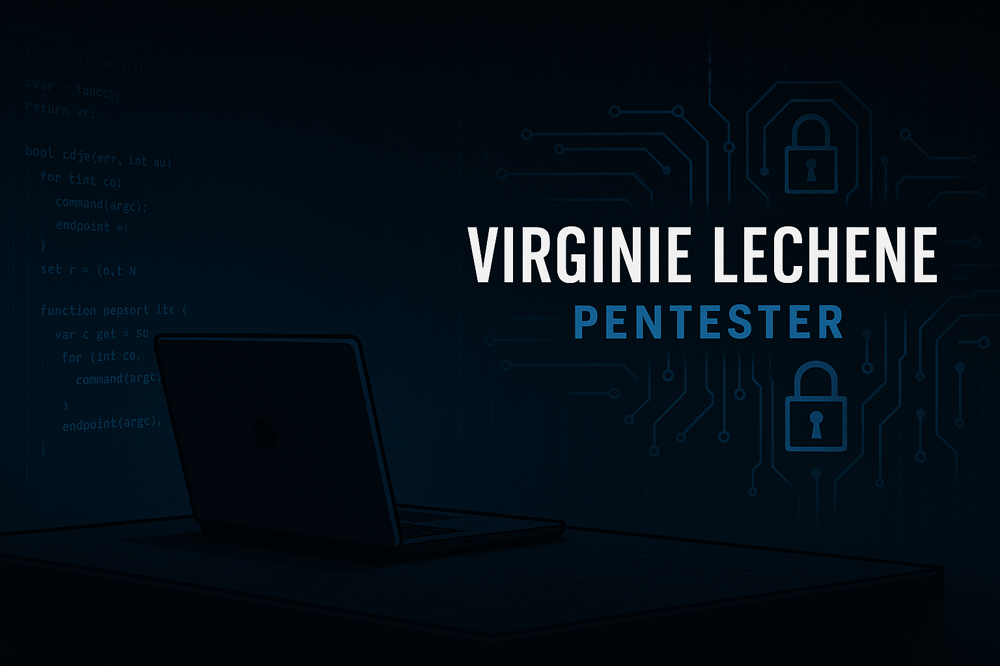

# Virginie Lechene

Welcome to my portfolio focused on offensive and defensive cybersecurity.
Pentesting • Offensive security • GDPR awareness • Vulnerability analysis

## My GitHub Projects

- [Brute Force – Educational exercise](https://github.com/virg736/brute-force-exercice)
Demonstration of a brute-force attack on a fictitious password.

